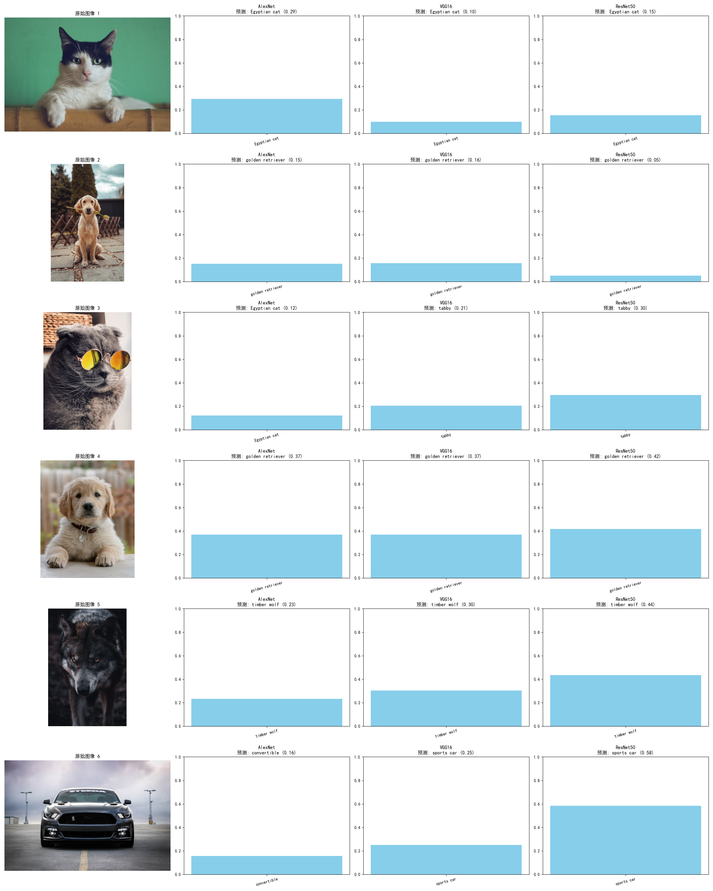

# ImageClassification_modelcomparison
北邮AI信息网络实验-test1-基于PyTorch的经典卷积神经⽹络图像分类性能对⽐
学号：2023212294 杨珺涵

## 1. 实验目的与核心思路

本实验的核心目的在于：**利用 PyTorch 加载并横向对比三种具有里程碑意义的预训练卷积神经网络（AlexNet, VGG16, ResNet50）在图像分类任务上的表现。**

为了达成这一目的，我们确立了以下核心思路：

1.  **模型对比维度**：不仅要对比最终的预测结果，还要从更深层次的**网络结构、参数量、网络深度**等维度进行分析，理解其设计哲学的差异。
2.  **性能量化**：使用模型对同一张图片预测出的**类别（Label）**和**置信度（Confidence）**作为最直观的性能量化指标。
3.  **可解释性分析**：为了回答“为什么某个模型表现更好”这一关键问题，我们引入**热力图（Heatmap）**可视化技术（即 Grad-CAM），来探索模型在做决策时，其“注意力”究竟集中在图像的哪个区域。
4.  **鲁棒性测试**：为了更全面地评估模型，我们后续引入了**易错（Hard Case）和有歧义的样本**，观察模型在面对挑战时的表现和失败模式（Failure Case）。

---

## 2. 实验结果与分析

### 2.1 模型结构与参数量对比

我们首先对三个模型的结构和参数量进行了量化分析，结果如下：

```
================================================================================
模型名称            | 层数         | 总参数量            | 结构特点
--------------------------------------------------------------------------------
AlexNet         | 8层         |     61,100,840 | 5个卷积层 + 3个全连接层
VGG16           | 16层        |    138,357,544 | 13个卷积层 + 3个全连接层
ResNet50        | 50层        |     25,557,032 | 残差连接 (Residual Connection)
================================================================================
```

- **分析**：可以发现，虽然 ResNet50 网络最深（50层），但其参数量反而最少。这主要得益于其引入的残差结构和全局平均池化层，极大地减少了全连接层的参数。而 VGG16 由于其庞大的全连接层，参数量是三者中最大的。

### 2.2 置信度对比分析 (条形图)

我们对 6 张样本图片（包含常规与挑战性样本）进行了推理，并将预测置信度以条形图展示。



- **分析**：
    1.  **常规样本**：在猫、狗、汽车等常规样本上，ResNet50 通常能给出比 AlexNet 和 VGG16 更高的置信度。
    2.  **挑战性样本**：在第 4 张“博美犬”的图片上，所有模型都发生了**误判**，将其识别为了“golden retriever”（金毛犬），且置信度都不高（0.3-0.4之间），说明模型在细粒度分类上存在挑战。
    3.  **分类精度差异**：在第 6 张“跑车”的图片上，AlexNet 将其错误地预测为 "convertible" (敞篷车)，且置信度极低（0.16）；而 VGG16 和 ResNet50 均能准确识别为 "sports car" (跑车)，其中 ResNet50 的置信度（0.58）显著高于 VGG16 (0.25)。这再次证明了深层模型在提取细微特征方面的优势。

### 2.3 模型注意力分析 (热力图)

为了探究模型做出上述判断的“视觉依据”，我们使用 Grad-CAM 生成了热力图。


- **分析**：
    1.  **注意力精准度**：可以清晰地看到，从 AlexNet 到 VGG16 再到 ResNet50，模型的“注意力”**越来越精准**。在第一张猫的图片上，ResNet50 的热区几乎完全聚焦在猫的五官，而 AlexNet 则分散在整个上半身。
    2.  **失败案例归因**：在第 4 张“博美犬”的图上，热力图显示所有模型都将注意力集中在了其**金黄色的毛发**上，而忽略了体型、脸型等关键差异，这直接导致了其被误判为“金毛犬”。
    3.  **决策依据差异**：在第 6 张跑车的图上，ResNet50 精准地聚焦在**车标和前脸格栅**这些最具辨识度的区域，而 AlexNet 和 VGG16 的注意力则相对分散，这解释了为什么 ResNet50 对“sports car”的判断更自信。

---

## 3. 思考与展望

### 3.1 实验的深度思考与反思

在完成实验后，我对实验结果的可靠性及 CNN 模型的本质进行了更深层次的批判性思考：

1.  **置信度 (Confidence) 与正确率 (Accuracy) 的辩证关系**：
    - 实验中观察到的“置信度”是由 Softmax 层输出的概率分布，它代表模型“主观上”认为属于某一类的程度。
    - **置信度 $\neq$ 正确率**。博美犬被误认为金毛的案例（Confidence 约 0.4）生动展示了模型可能会“自信地犯错”。高置信度只能说明输入图像符合模型学到的某种模式，并不代表预测绝对正确。

2.  **样本选取的代表性与局限性**：
    - 本实验选取的 6 张图片属于**案例定性研究 (Case Study)**。虽然它们具有启发性，能快速暴露模型弱点，但不具备统计学代表性。
    - 严谨的模型评价需要在大规模验证集（如 ImageNet Val，包含 50,000 张图）上运行，计算 **Top-1 和 Top-5 Accuracy**，才能得出具备统计学意义的性能结论。

3.  **细粒度分类与语义理解的瓶颈**：
    - 模型能分出品种，是因为 ImageNet 训练集中包含了丰富的犬种数据。但面对极度相似的品种或环境干扰时，鲁棒性依然不足。
    - **“看到”不代表“看懂”**：热力图显示 ResNet 能精准定位特征，但它无法区分“材质”（如雕像 vs 活体），说明当前的 CNN 仍处于高级模式匹配阶段，缺乏真正的物理世界常识和逻辑推理。

### 3.2 未来改进方向

*   **数据驱动**：要解决细粒度分类问题，需要针对特定领域（如宠物、植物）使用更大规模、标注更精细的数据集进行**微调 (Fine-tuning)**。
*   **架构演进**：探索引入全局感知能力更强的架构（如 **Vision Transformer, ViT**），以弥补 CNN 在处理长距离空间关系上的不足。
*   **多模态融合**：引入文本、深度等多维度信息，帮助模型理解物体背后的深层语义（如通过上下文判断是雕像还是真实动物）。

---

## 4. 总结

总而言之，这次实验不仅让我掌握了 PyTorch 的工程应用，更让我学会了如何透过“置信度”和“热力图”去审视深度学习模型的内在机理。ResNet50 的成功证明了残差连接对特征提取的巨大贡献，而实验中的失败案例则为我指明了未来探索计算机视觉领域更深层次语义理解的方向。
